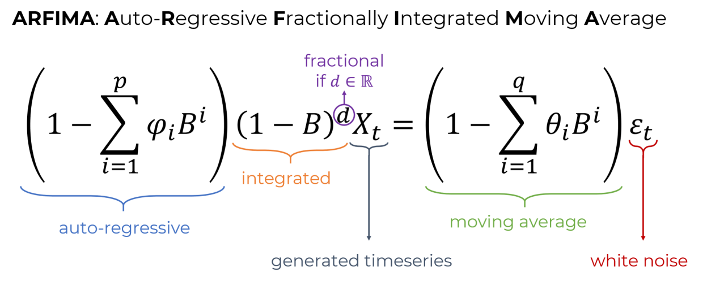

# ARFIMA.jl
This Julia package simulates stochastic timeseries that follow the ARFIMA process, or any of its simplifications: ARIMA/ARMA/AR/MA/IMA.

The code base is also a proof-of-concept of using Julia's multiple dispatch.

## ARFIMA and its variants


The ARFIMA process is composed out of several components and each can be included or not included in the process, resulting in simplified versions like ARMA.

## Usage
This package exports a single function `arfima`. This function  generates the timeseries `Xₜ` using Julia's multiple dispatch.

Here is its documentation string:

---

    arfima([rng,] N, σ, d, φ=nothing, θ=nothing) -> Xₜ
Create a stochastic timeseries of length `N` that follows the ARFIMA
process, or any of its subclasses, like e.g. ARMA, AR, ARIMA, etc., see below.
`σ` is the standard deviation of the white noise used to generate the
process. The first optional argument is an `AbstractRNG`, a random
number generator to establish reproducibility.

The generating equation for `Xₜ` is:
```math
\\left( 1 - \\sum_{i=1}^p \\phi_i B^i \\right)
\\left( 1-B \\right)^d X_t
=
\\left( 1 + \\sum_{i=1}^q \\theta_i B^i \\right) \\varepsilon_t
```
with ``B`` the backshift operator and ``\\varepsilon_t`` white noise.

This equation encapsulates all possible variants of ARFIMA and Julia's
multiple dispatch system decides which will be the simulated variant,
based on the types of `d, φ, θ`.

## Variants
The ARFIMA parameters are (p, d, q) with `p = length(φ)` and `q = length(θ)`,
with `p, q` describing the autoregressive or moving average "orders" while
`d` is the differencing "order".
Both `φ, θ` can be of two types: `Nothing` or `SVector`. If they are `Nothing`
the corresponding components of autoregressive (φ) and moving average (θ)
are not done. Otherwise, the static vectors simply contain their values.

If `d` is `Nothing`, then the differencing (integrated)
part is not done and the process is in fact AR/MA/ARMA.
If `d` is of type `Int`, then the simulated process is in fact ARIMA,
while if `d` is `AbstractFloat` then the process is AR**F**IMA.
In the last case it must hold that `d ∈ (-0.5, 0.5)`.

If all `d, φ, θ` are `nothing`, white noise is returned.
